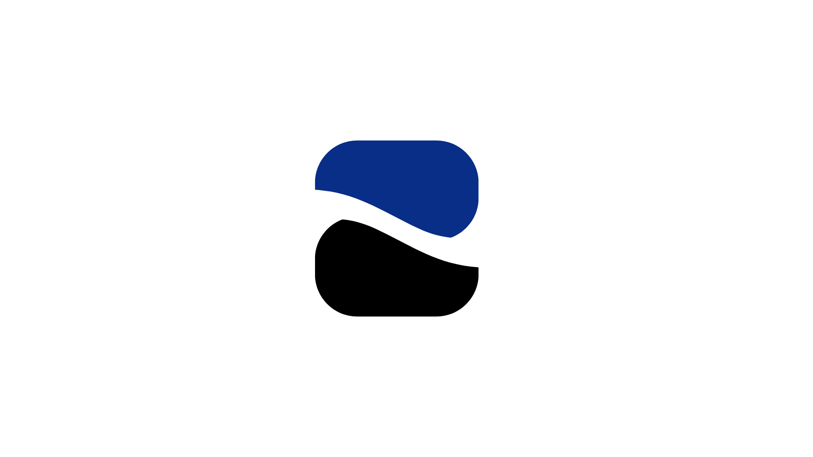

# SparTask - TCC da ETEC

Este é o repositório do meu projeto do trabalho de conclusão.

## Sobre

O site é baseado em um sistema que facilita a rotina dos profissionais de limpeza domiciliar e também auxilia os potenciais clientes a adquirirem esses serviços. Ele serve tanto para a divulgação dos serviços prestados quanto para o gerenciamento de tarefas e dashboards, incluindo um chat interativo com o cliente.


## 🗂 Estrutura do Projeto
```
/assets
├── css
│ └── style.css # Estilos
│ └── session.css # Estilos para a aba home.php
├── img
│ └── # Imagens e logos usados no site
├── PHP
│ └── # Onde eu guardo todos os includes do PHP
└── js
└── script.js # Scripts JavaScript para interatividade

/public
│ └── about.php # Sobre nós
│ └── index.php # Página Principal
│ └── home.css # Para usuarios cadastrados

index.html # Página principal do portfólio
README.md # Documentação do projeto

```
## 🛠️ Tecnologias Utilizadas

- HTML5
- CSS3
- Bootstrap 5.3
- PHP
- JavaScript
- Font Awesome
- V-Libras (acessibilidade)
- acsbJS (acessibilidade avançada)

## 🔗 Visualização Online

Você pode acessar o site online [clicando aqui](https://spartask.onrender.com)

## 📱 Contato

Entre em contato diretamente pelo [WhatsApp](https://wa.me/5513996061925)

## 🧩 Licença

Este projeto está sob a licença MIT.